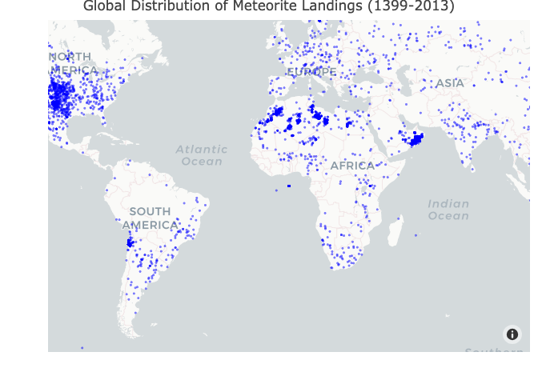
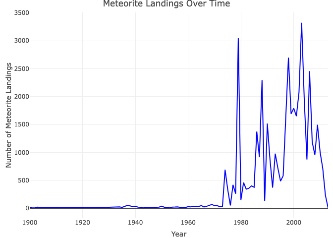

final project
================
Zitao Zhang, Yi Su, Jiayi Ge
2024-11-14

``` r
meteorite_data <- read.csv("data/meteorite-landings.csv")

meteorite_data <- meteorite_data %>% 
  clean_names() %>%
  filter(year >= 1900 & year <= 2013) %>% 
  select(-fall)

meteorite_data_cleaned <- meteorite_data %>%
  filter(!is.na(reclat) & !is.na(reclong)) %>%
  filter(!is.na(mass) & !is.na(year))

summary(meteorite_data_cleaned)
```

    ##      name                 id          nametype           recclass        
    ##  Length:37408       Min.   :    2   Length:37408       Length:37408      
    ##  Class :character   1st Qu.:10892   Class :character   Class :character  
    ##  Mode  :character   Median :21902   Mode  :character   Mode  :character  
    ##                     Mean   :25552                                        
    ##                     3rd Qu.:40134                                        
    ##                     Max.   :57458                                        
    ##       mass               year          reclat          reclong       
    ##  Min.   :       0   Min.   :1900   Min.   :-87.37   Min.   :-165.43  
    ##  1st Qu.:       6   1st Qu.:1986   1st Qu.:-76.72   1st Qu.:   0.00  
    ##  Median :      28   Median :1996   Median :-71.50   Median :  35.67  
    ##  Mean   :    7214   Mean   :1993   Mean   :-40.93   Mean   :  62.66  
    ##  3rd Qu.:     167   3rd Qu.:2003   3rd Qu.:  0.00   3rd Qu.: 157.17  
    ##  Max.   :60000000   Max.   :2013   Max.   : 81.17   Max.   : 178.20  
    ##  geo_location      
    ##  Length:37408      
    ##  Class :character  
    ##  Mode  :character  
    ##                    
    ##                    
    ## 

``` r
meteorite_sf <- st_as_sf(meteorite_data_cleaned, coords = c("reclong", "reclat"), crs = 4326, remove = FALSE)

continents <- ne_countries(scale = "medium", returnclass = "sf") %>%
  group_by(continent) %>%
  summarise()

meteorite_data_with_continents <- st_join(meteorite_sf, continents["continent"], join = st_intersects)

meteorite_data_with_continents <- meteorite_data_with_continents %>%
  mutate(continent = replace_na(continent, "Ocean"))

print(meteorite_data_with_continents)
```

    ## Simple feature collection with 37408 features and 10 fields
    ## Geometry type: POINT
    ## Dimension:     XY
    ## Bounding box:  xmin: -165.4333 ymin: -87.36667 xmax: 178.2 ymax: 81.16667
    ## Geodetic CRS:  WGS 84
    ## First 10 features:
    ##                   name  id nametype     recclass   mass year    reclat
    ## 1               Aarhus   2    Valid           H6    720 1951  56.18333
    ## 2                 Abee   6    Valid          EH4 107000 1952  54.21667
    ## 3             Acapulco  10    Valid  Acapulcoite   1914 1976  16.88333
    ## 4              Achiras 370    Valid           L6    780 1902 -33.16667
    ## 5             Adhi Kot 379    Valid          EH4   4239 1919  32.10000
    ## 6  Adzhi-Bogdo (stone) 390    Valid        LL3-6    910 1949  44.83333
    ## 7               Aguada 398    Valid           L6   1620 1930 -31.60000
    ## 8        Aguila Blanca 417    Valid            L   1440 1920 -30.86667
    ## 9     Aioun el Atrouss 423    Valid Diogenite-pm   1000 1974  16.39806
    ## 10                 Aïr 424    Valid           L6  24000 1925  19.08333
    ##       reclong             geo_location     continent                  geometry
    ## 1    10.23333   (56.183330, 10.233330)        Europe POINT (10.23333 56.18333)
    ## 2  -113.00000 (54.216670, -113.000000) North America     POINT (-113 54.21667)
    ## 3   -99.90000  (16.883330, -99.900000) North America    POINT (-99.9 16.88333)
    ## 4   -64.95000 (-33.166670, -64.950000) South America  POINT (-64.95 -33.16667)
    ## 5    71.80000   (32.100000, 71.800000)          Asia         POINT (71.8 32.1)
    ## 6    95.16667   (44.833330, 95.166670)          Asia POINT (95.16667 44.83333)
    ## 7   -65.23333 (-31.600000, -65.233330) South America   POINT (-65.23333 -31.6)
    ## 8   -64.55000 (-30.866670, -64.550000) South America  POINT (-64.55 -30.86667)
    ## 9    -9.57028   (16.398060, -9.570280)        Africa POINT (-9.57028 16.39806)
    ## 10    8.38333    (19.083330, 8.383330)        Africa  POINT (8.38333 19.08333)

``` r
fig <- plot_ly(
  data = meteorite_data,
  type = 'scattermapbox',
  lat = ~reclat,
  lon = ~reclong,
  mode = 'markers',
  marker = list(size = 4, color = 'blue', opacity = 0.5),
  text = ~paste("Name:", name, "<br>Year:", year, "<br>Mass:", mass)
)

fig <- fig %>%
  layout(
    title = 'Global Distribution of Meteorite Landings (1399-2013)',
    mapbox = list(
      style = "carto-positron",
      zoom = 1
    )
  )

fig
```

<!-- -->

``` r
yearly_landings <- meteorite_data %>%
  group_by(year) %>%
  summarise(count = n())

# Line plot with Plotly
fig <- plot_ly(
  data = yearly_landings,
  x = ~year,
  y = ~count,
  type = 'scatter',
  mode = 'lines',
  line = list(color = 'blue')
) %>%
  layout(
    title = 'Meteorite Landings Over Time',
    xaxis = list(title = 'Year'),
    yaxis = list(title = 'Number of Meteorite Landings')
  )

fig
```

<!-- -->
